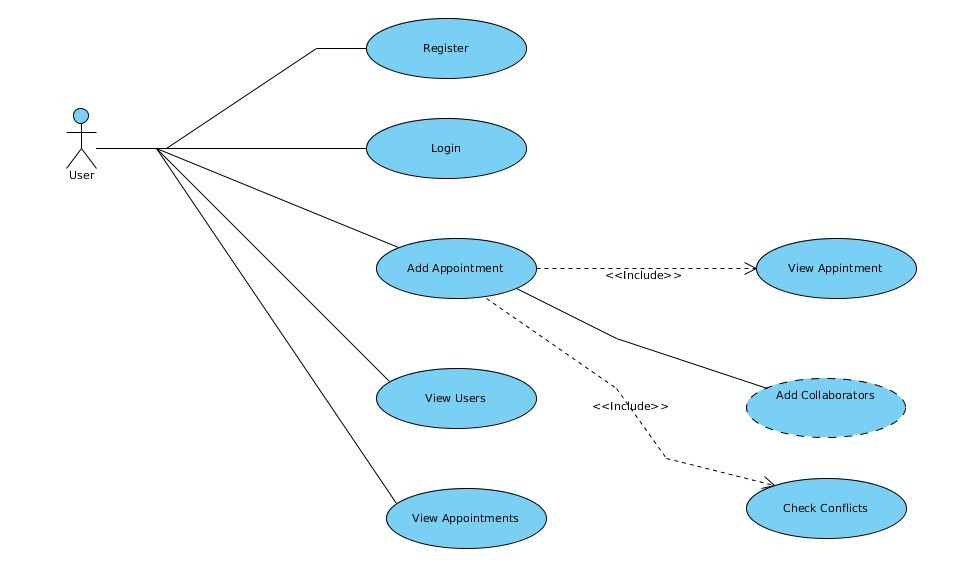
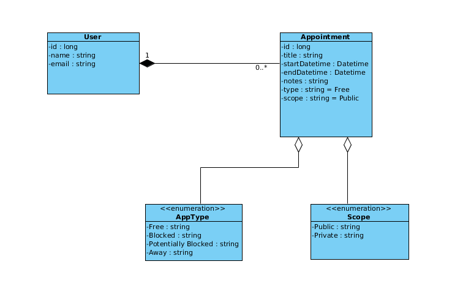
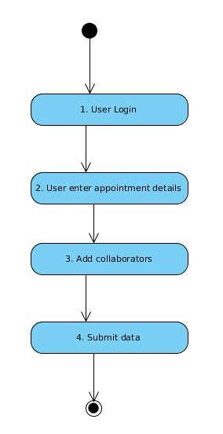
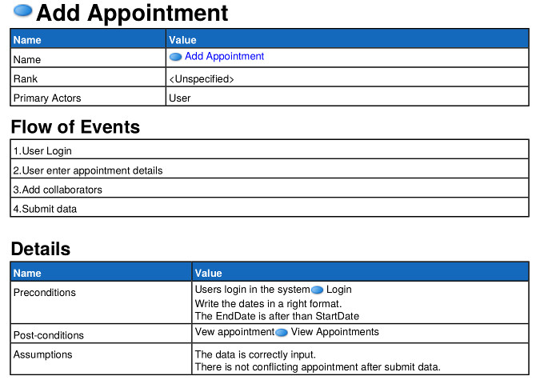
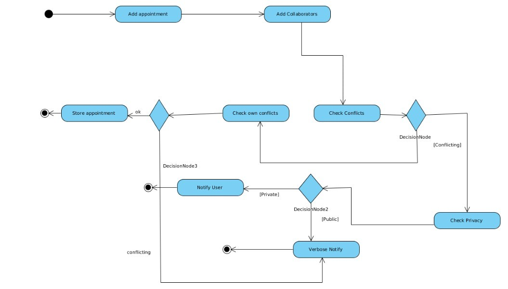

# Appointment-Management
The new repository for the CBSE course project.

This is just a homework of Component Based System Engineer.
You can simple build the .war file component using maven. A project object model file is provided to do this.
Then you can simple deployed on an Apache Tomcat server.

The development environment consist of the following tools:

  * IDE Eclipse Juno Java EE + EJB, Jboss Tools and Integration plugins, Maven
  * Jboss AS 7.1.1
  * Maven as project builder
  
  The Java technologies such as EJB, JPA, Hibernate, JSF for the friendly web user interfaces  are implicit in the project development.
  
  Must of the errors and warning are shown in the log console and only a few in 
  the web UI messaging, due to agile development although we consider the possibility
  of show the messages in the web UI, this is not the main subject of the project.
  
  ## Maven.
  
  Maven is used as project builder for Appointment Management application. Maven is an advance project building toolkit, considered as an evolution  of ANT.
  For more information about Maven please read the info available on internet from
  the original sources and project home web site. 
  As the result of Maven execution a .war file is generated and automatically deployed
  on the Jboss AS Server, for this the necessary  configurations are done in the 
  Integration Development Environment.
  
  In our development phase we set a Ram mem database by editing the appropriate setting
  in the persists.xml file and the datasource file for Hibernate to handle this DB
  with the H2 DB dialect. However in production it is possible to maintain a MySQL, ORACLE, PostGres or any other DB manager.
  
  As the functional specification are given and the business model is described 
  in some diagrams we do not write a lot amount of comments in the source code.
  Furthermore the project does not contains a lot quantity of lines codes in spite of
  the complexity of the technologies. Regarding "complexity" I meant that in order to
  understand how EJB and the corresponding Java technologies works, it is required
  an important amount of time to dedicate in the learning process. And this way
  also the comprehension of Component Based Software Engineering in the Java World.

## UML designs.

## Activity Diagram. (Add Appointment Use Case.)

**Note:**
We only write down the details for add appointment as for the login and register functionality is straightforward.

